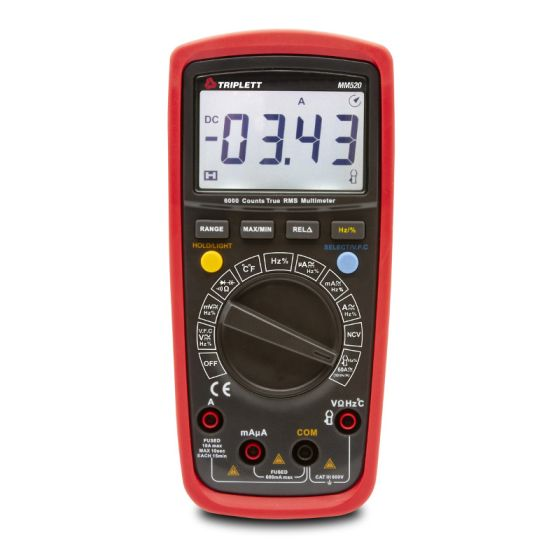

# DMM Usage — Triplett MM520

Quick reference for the Triplett MM520 True RMS digital multimeter. 6000-count display, CAT III-600V rated.

## Mode Selection

Rotate the dial to select the primary function. The button panel modifies behavior within each mode.

| Dial Position | Function | Notes |
|---|---|---|
| V⎓ | DC Voltage | Auto-range, 600 mV to 600V |
| V~ | AC Voltage | True RMS, auto-range |
| mV⎓/~ | Millivolt DC/AC | Toggle DC/AC with SELECT |
| µA⎓/~ | Microamp DC/AC | 600 µA range |
| mA⎓/~ | Milliamp DC/AC | 600 mA range |
| A⎓/~ | Amps DC/AC | 10A range, separate jack |
| Ω | Resistance | Auto-range, up to 60 MΩ |
| ⏛ | Continuity | Beeps below ~10Ω |
| ⏛/▶ | Diode test | Shows forward voltage drop |
| F | Capacitance | Up to 100 mF |
| Hz/% | Frequency / Duty Cycle | Up to 10 MHz |
| °C/°F | Temperature | K-type thermocouple input |

## Probe Connections

| Jack | Use |
|---|---|
| **COM** | Black lead — always |
| **V/Ω/Hz/°C** | Red lead for voltage, resistance, frequency, capacitance, temperature, diode, continuity |
| **mA/µA** | Red lead for mA and µA current |
| **10A** | Red lead for high-current measurements only |

**Caution:** Plugging the red lead into the current jack and then probing across a voltage source creates a near-short through the meter's current shunt. This blows the fuse or worse.

## Key Button Functions

| Button | What It Does |
|---|---|
| **SELECT** | Toggles between sub-modes (DC/AC, °C/°F) |
| **RANGE** | Cycles through manual ranges; hold for auto-range |
| **REL** | Relative mode — zeroes the display, shows delta from reference |
| **HOLD** | Freezes the current reading on the display |
| **MIN/MAX** | Records and displays minimum and maximum readings |
| **LPF** | Low Pass Filter — filters out high-frequency noise (useful on VFD-driven circuits) |
| **LoZ** | Low impedance mode — uses low input impedance to reject ghost voltages |
| **NCV** | Non-Contact Voltage detection — hold meter near a conductor to detect live AC |
| **LIGHT** | Toggles backlight |

## Common Procedures

### Quick DC Voltage Check

1. Red lead in V/Ω jack, black in COM
2. Dial to V⎓
3. Probe red to test point, black to ground
4. Read the display — auto-range selects the right scale

### Checking for Ghost Voltages

If you read an unexpected voltage on a supposedly dead circuit:

1. Press **LoZ** to switch to low-impedance input mode
2. Re-measure — if the reading drops to zero or near-zero, the original reading was a ghost voltage from capacitive coupling
3. If the reading persists in LoZ mode, the voltage is real

### Continuity Check

1. Dial to ⏛
2. Touch probes to the two points
3. Beep = connection (< ~10Ω), no beep = open
4. Watch the resistance reading for marginal joints — a beep at 5Ω is different from a beep at 0.2Ω

### Using LPF (Low Pass Filter)

When measuring AC voltage on circuits driven by variable frequency drives (VFDs) or PWM:

1. Dial to V~ (AC Volts)
2. Press **LPF** to enable the low-pass filter
3. This filters out high-frequency switching noise and shows the fundamental frequency component
4. Without LPF, the True RMS reading includes the switching frequency content and reads higher than the actual power-frequency voltage

### Relative Mode for Small Differences

1. Short the probes together (or place on a reference point)
2. Press **REL** — display zeros
3. Now measure — the display shows the difference from the reference
4. Useful for: measuring small resistances (zeroing out lead resistance), comparing components, tracking drift
