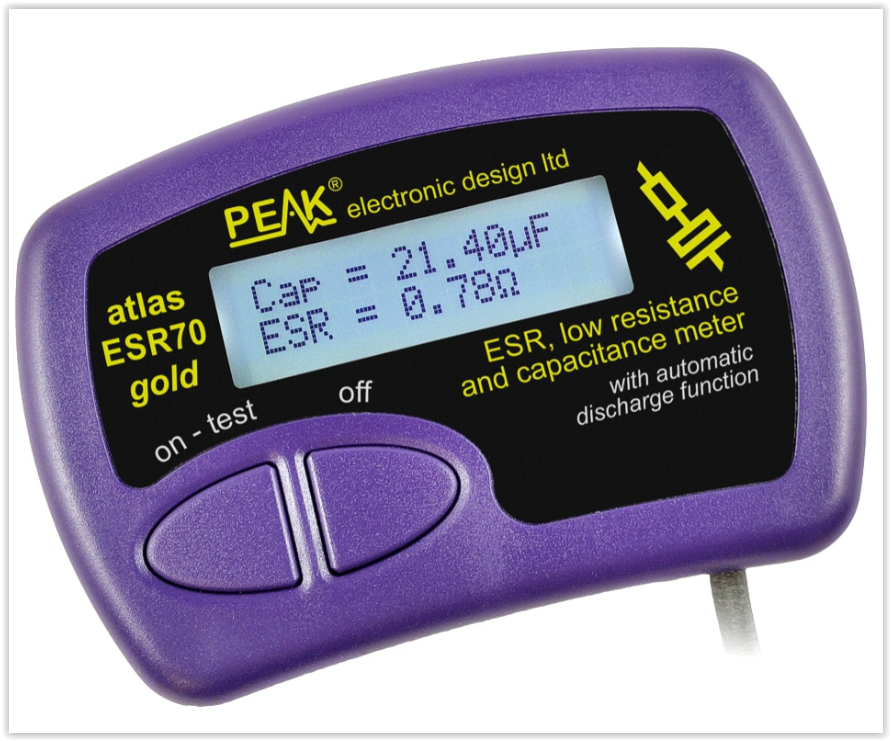

# Peak Atlas ESR70 — ESR Meter

Capacitor ESR and capacitance meter. Measures ESR in-circuit, capacitance out-of-circuit. Audible alerts for quick screening.

## At a Glance

| Parameter | Value |
|---|---|
| ESR range | 0.00Ω to 40.0Ω |
| Capacitance range | 0.3 µF to 90,000 µF |
| Test frequency | 50–100 kHz (±4%) |
| Test voltage | ~40 mV typical (into 40Ω) |
| In-circuit capable | ESR only (not capacitance) |
| Display | Alphanumeric LCD with backlight |
| Power | 1× AAA (alkaline, NiMH, or LiFe) |

---

## Basic Operation

The ESR70 is about as simple as a test instrument gets:

1. Power on (single button)
2. Touch probes to the capacitor
3. Read the display — ESR in ohms, capacitance in µF
4. That's it. No mode selection, no range setting.

The meter auto-starts measurement when it detects a component on the probes.

## What the Display Shows

| Reading | Meaning |
|---|---|
| ESR value (Ω) | Equivalent series resistance at the test frequency (~50–100 kHz) |
| Capacitance (µF) | Measured capacitance (out-of-circuit only) |
| Audible tone | Pitch varies with ESR — low tone = low ESR (good), high tone = high ESR (suspect) |

## Probe Connections

- Gold-plated crocodile clips with 2mm plugs
- Probes are removable — any 2mm-compatible probes can be used
- Extra-long silicone-covered cables (450mm)
- For tight spaces, remove the crocodile clips and use the bare probe tips

## Procedures

### Out-of-Circuit Capacitor Test

The full test — gives you both ESR and capacitance:

1. **Discharge the capacitor first.** Short the leads with a resistor (100Ω is fine) to safely drain any stored charge
2. Remove the capacitor from the circuit (desolder at least one lead)
3. Connect the ESR70 probes to the capacitor leads
4. Read ESR and capacitance
5. Compare to the part's rated values

### In-Circuit ESR Test

Faster but limited — gives ESR only, no capacitance:

1. **Power off the circuit and discharge capacitors**
2. Leave the capacitor soldered in place
3. Connect probes to the capacitor's pads
4. Read ESR value

**In-circuit caveats:**
- Parallel components (other capacitors, low-impedance paths) affect the reading
- The reading shows the ESR of whatever impedance the probes see — which may not be just the one capacitor
- Use in-circuit ESR as a screening tool: if the reading is clearly high, the cap is bad. If the reading looks normal, it might still be bad (parallel paths masking it)
- For definitive testing, desolder and test out-of-circuit

### Low-Ohms Resistance Check

The ESR70 also works as a low-ohms resistance meter:

1. Touch probes to the component or connection
2. Read the resistance — useful for checking trace resistance, connector contact resistance, or very low-value resistors
3. Resolution: 0.01Ω below 2Ω

## Interpreting ESR Readings

### What's "Good" ESR?

ESR depends on capacitance value, voltage rating, and capacitor series. Rough guidelines for aluminum electrolytics:

| Capacitance | Voltage | Typical Good ESR |
|---|---|---|
| 1000 µF | 16V | < 0.05Ω |
| 470 µF | 25V | < 0.1Ω |
| 100 µF | 25V | < 0.2Ω |
| 47 µF | 50V | < 0.5Ω |
| 10 µF | 50V | < 1.0Ω |
| 1 µF | 50V | < 5Ω |

**Always check the specific part's datasheet** — these are rough screening values. Low-ESR series caps have much tighter specs than general-purpose parts.

### Warning Signs

- ESR much higher than expected → capacitor is drying out, degraded, or heat-damaged
- ESR reads open (no reading) → capacitor has failed open
- Capacitance correct but ESR high → the cap looks OK on a capacitance meter but is actually failing. This is the classic electrolytic failure mode.

## Audible Alerts

The ESR70 uses pitch to indicate ESR level — you can test capacitors without looking at the display:

- **Low pitch:** Low ESR (good)
- **High pitch:** High ESR (suspect)
- **No tone / error tone:** Open or out of range

This is useful when you're testing a row of capacitors on a board and want to quickly find the outlier.

## Tips

- **Always discharge capacitors before testing.** The ESR70 injects a small test signal (~40 mV) and is not designed to handle charged caps. A charged capacitor won't damage the meter but will give a wrong reading.
- **Test at room temperature.** ESR changes with temperature — cold caps measure higher ESR. The spec'd operating range is 15–35°C.
- **Auto power-off** kicks in after ~1 minute of inactivity. Just press the button to wake it up.
- **Probe contact matters.** Bad contact on the crocodile clips adds resistance that shows up in the ESR reading. Clean the capacitor leads if they're oxidized.

---

## Specifications

### ESR Measurement

| Parameter | Value |
|---|---|
| Range | 0.00Ω to 40.0Ω |
| Resolution (ESR < 2Ω) | 0.01Ω to 0.02Ω |
| Resolution (ESR > 2Ω) | 0.1Ω to 0.2Ω |
| Accuracy | ±2% typical |
| Test frequency | 50–100 kHz (±4%) |
| Test voltage | ~40 mV typical |

### Capacitance Measurement

| Parameter | Value |
|---|---|
| Range | 0.3 µF to 90,000 µF |
| Conditions | Out-of-circuit only |

Capacitance measurement is available only when the capacitor is disconnected from the circuit. In-circuit, only ESR is reported.

### Operating Conditions

| Parameter | Value |
|---|---|
| Operating temperature | 15°C to 35°C (60°F to 95°F) |
| Auto power-off | ~1 minute |
| Low battery protection | Will not operate if battery is low |

### Probes

| Parameter | Value |
|---|---|
| Type | Gold-plated crocodile clips |
| Connector | 2mm plugs (removable) |
| Cable length | 450 mm silicone-covered |
| Compatible | Any 2mm probes |

---

## Limits to Know

These are the situations where this meter won't give you a trustworthy answer:

- **ESR ceiling (40Ω):** Capacitors with ESR above 40Ω read as out of range. Very small or very degraded caps may exceed this. But honestly, if ESR is above 40Ω, the cap is dead anyway.
- **Capacitance floor (0.3 µF):** Can't measure ESR on caps below 0.3 µF. Small ceramic caps, film caps, and most non-electrolytic types are out of range.
- **In-circuit accuracy:** In-circuit ESR readings are approximate. Parallel capacitors, traces, and low-impedance paths affect the measurement. A suspiciously low in-circuit reading may mean the meter is seeing a parallel path, not the capacitor's true ESR.
- **Test frequency (50–100 kHz):** ESR is frequency-dependent. The ESR70 tests at ~100 kHz, which is relevant for switching power supply decoupling. ESR at other frequencies (e.g., audio) may differ.
- **Temperature sensitivity:** ESR increases at lower temperatures. If you're testing caps in a cold environment (below 15°C), the reading may be higher than the datasheet spec measured at 25°C. This is the cap's behavior, not a meter error — but be aware of it.
- **Charged capacitors:** The meter expects the capacitor to be discharged. A charged cap will give an incorrect reading and may confuse the auto-detection. Always discharge first.
- **Resolution limits:** Below 2Ω, resolution is 0.01–0.02Ω. For very low-ESR caps (polymer, MLCC), differences of 0.01Ω are at the resolution limit and shouldn't be over-interpreted.

## Reference Links

- [Peak ESR70 product page](https://www.peakelec.co.uk/acatalog/esr70-capacitor-esr-meter.html)
- [ESR70 resources and downloads](https://www.peakelec.co.uk/resources/esr70.html)
- [ESR70 datasheet (PDF)](https://www.peakelec.co.uk/downloads/esr70-datasheet-en.pdf)
