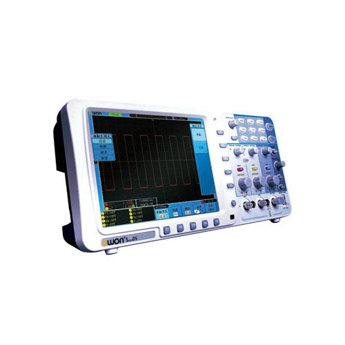

# Owon SDS7102V — Oscilloscope

100 MHz bandwidth, 2 channels, 1 GSa/s (single channel), 10 Mpts record length, 8-inch color LCD.

## At a Glance

| Parameter | Value |
|---|---|
| Channels | 2 analog + 1 external trigger |
| Bandwidth | 100 MHz |
| Sample rate | 1 GSa/s (1 channel), 500 MSa/s (2 channels) |
| Record length | 10 Mpts per channel |
| Vertical resolution | 8 bits (256 levels) |
| Display | 8" TFT LCD, 800 × 600 |
| Max input voltage | 400V peak (1 MΩ input) |

## Channel Setup

| Control | Function |
|---|---|
| **CH1 / CH2** | Select channel to configure |
| **Vertical scale knob** | Sets V/div (2 mV/div to 10 V/div) |
| **Vertical position knob** | Moves waveform up/down on screen |
| **Coupling** (menu) | DC, AC, or GND |
| **Probe attenuation** (menu) | Set to match probe: 1x, 10x, 100x, 1000x |
| **BW Limit** (menu) | 20 MHz bandwidth limit — reduces high-frequency noise |
| **Invert** (menu) | Flips waveform vertically |

**Important:** Always set probe attenuation in scope menu to match physical probe setting. If probe is 10x but scope thinks 1x, all voltage readings are off by 10×.

## Timebase

| Control | Function |
|---|---|
| **Horizontal scale knob** | Sets time/div (2 ns/div to 5 s/div) |
| **Horizontal position knob** | Moves waveform left/right |

### Choosing Timebase

- 3–5 cycles visible: appropriate for most waveforms
- 1 kHz signal → ~200 µs/div
- 1 MHz signal → ~200 ns/div
- Power-up capture → 50–100 ms/div

## Triggering

| Setting | Options |
|---|---|
| **Source** | CH1, CH2, External |
| **Type** | Edge, Video (NTSC/PAL/SECAM) |
| **Slope** | Rising or falling edge |
| **Level** | Adjust with trigger level knob — set to ~50% of waveform amplitude |
| **Mode** | Auto (free-running), Normal (waits for trigger), Single (one-shot) |

### Common Trigger Recipes

| Situation | Mode | Setup |
|---|---|---|
| Repetitive waveform | Auto or Normal | Edge trigger, rising, level at ~50% |
| One-shot event | Single | Set level just above/below event threshold, press Run, cause event |
| Noisy signal | Normal | Raise trigger level above noise floor |
| Two signals, timing relationship | Normal | Trigger on reference signal with clean edges |

## Coupling Modes

| Mode | When to Use |
|---|---|
| **DC** | Default. Shows full signal including DC offset. |
| **AC** | Blocks DC, shows only AC content. Use for ripple, small AC on large DC offset. |
| **GND** | Disconnects input, shows ground reference. Use to set zero-volt position. |

**AC coupling note:** Inserts high-pass filter blocking DC. Low-frequency signals (below ~10 Hz) get attenuated. Waveform "droops" on slow timebase settings.

## Measurements

### Automatic Measurements

Available via Measure menu:
- **Voltage:** Vpp, Vmax, Vmin, Vtop, Vbase, Vamp, Vavg, Vrms, Overshoot
- **Time:** Frequency, Period, Rise Time, Fall Time, Delay, Pulse Width, Duty Cycle

Up to 5 measurements displayed simultaneously.

### Cursors

- **Voltage cursors:** Two horizontal lines — read ΔV between them
- **Time cursors:** Two vertical lines — read ΔT and 1/ΔT frequency

### Math

- **CH1 + CH2, CH1 − CH2, CH1 × CH2** — useful for differential measurements
- **FFT** — frequency domain view

## Probe Compensation

Perform every time a new probe is used or probe settings change:

1. Connect probe to **PROBE COMP** output (square wave reference)
2. Display the square wave
3. Examine corners:
   - Overshoot/ringing: overcompensated → turn trimmer down
   - Rounded corners/slow rise: undercompensated → turn trimmer up
   - Clean square corners: compensated correctly
4. Adjust trimmer on probe until corners are square

## Common Procedures

### Measuring a DC Rail

DC coupling, probe attenuation set correctly. Set vertical scale to show expected voltage. Probe the rail, read DC level from auto-measurement or cursor.

### Measuring Ripple

AC coupling to reject DC component. BW Limit ON (20 MHz). Use tip-and-barrel probing. Set vertical scale to see ripple (start at 10–50 mV/div). Read Vpp from auto-measurement.

### Capturing a Single Event

Set trigger mode to **Single**. Set trigger source, slope, and level. Set timebase to capture event duration. Press **Run** — scope arms and waits. Cause event — scope triggers once and stops.

### Comparing Two Signals

Connect signals to CH1 and CH2. Trigger on reference signal. Both channels display simultaneously — observe amplitude, phase, timing.

## Specifications

### Vertical System

| Parameter | Value |
|---|---|
| Sensitivity | 2 mV/div to 10 V/div |
| Bandwidth | 100 MHz (−3 dB), 20 MHz with BW limit |
| Input impedance | 1 MΩ ∥ ~20 pF |
| Resolution | 8 bits |

Vertical accuracy is typically ±3–5% — significantly worse than DMM.

### Horizontal System

| Parameter | Value |
|---|---|
| Timebase range | 2 ns/div to 5 s/div |
| Sample rate (1 ch) | 1 GSa/s |
| Sample rate (2 ch) | 500 MSa/s |
| Record length | 10 Mpts per channel |

### Connectivity

| Interface | Use |
|---|---|
| USB (device) | PC connection |
| USB (host) | USB storage |
| VGA | External monitor |
| LAN | Remote control (SCPI) |

## Limits to Know

- **Bandwidth (100 MHz):** Signals above ~70 MHz are attenuated. A 100 MHz signal reads ~30% low. For accurate amplitude, keep frequency below ~33 MHz. Rise time limit: ~3.5 ns.
- **Sample rate vs. channels:** At 500 MSa/s dual-channel, Nyquist drops to 250 MHz. For fast signals on both channels, sample rate is the bottleneck.
- **8-bit vertical resolution:** 256 levels across screen. At 1 V/div (8V full-scale), each level is ~31 mV. Small signals on large ones get quantized.
- **Record length vs. sample rate:** 10 Mpts at 1 GSa/s gives 10 ms capture. Longer captures reduce sample rate.
- **Vertical accuracy (±3–5%):** A "3.30V" reading could be 3.13V–3.47V. Use DMM for absolute voltage.
- **2 channels only:** Multi-rail sequencing may require multiple passes.
- **Basic trigger types:** Edge and video only — no pulse width, runt, or serial decode.

## Reference Links

- [Batronix product page](https://www.batronix.com/shop/oscilloscopes/Owon-SDS7102V.html)
- [All About Circuits listing](https://www.allaboutcircuits.com/test-measurement/oscilloscopes/sds-series-sds7102v/)
